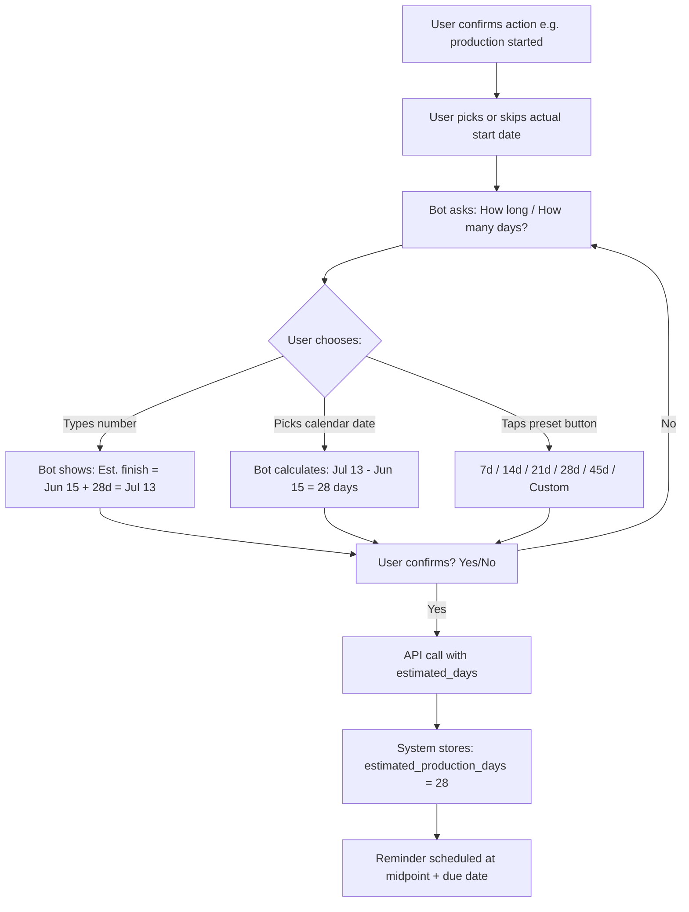
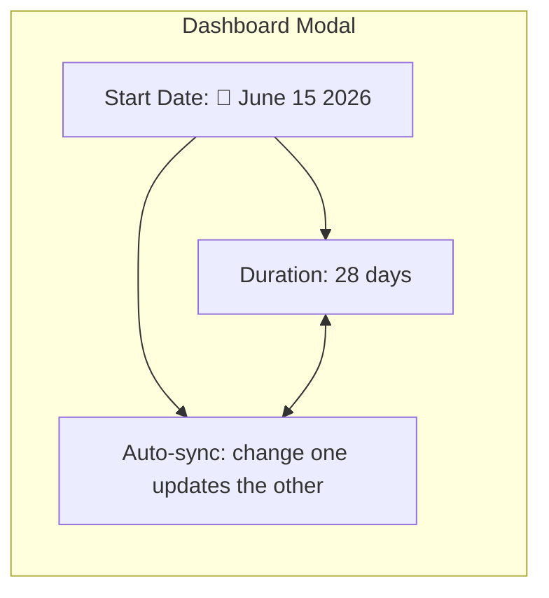

# Calendar + Days Sync — Complete UX Plan

## The Core Idea

When the bot asks "How long is production?" or "Estimated arrival days?", instead of just a number input, the user sees:

```
🏭 Production for QTN-20261805-02

Started: June 15, 2026

📅 Select finish date or enter days (they auto-sync):

[ 28 days ]  ← text input
or pick on calendar:
[📅 Mon Jun 15] [📅 Tue Jun 16] [📅 Wed Jun 17] ...
or quick presets:
[ 7 days ] [ 14 days ] [ 21 days ] [ 28 days ] [ 45 days ]
```

**If user types "28 days"** → calendar shows estimated finish date
**If user picks June 30 on calendar** → days auto-calculates to 15 days
**Both sync in real-time**

---

## Where This Applies

| Flow | Question | Start Date | Calculated End |
|------|----------|------------|----------------|
| Start Production | "How long is production?" | `production_started_at` (or chosen date) | `started_at + days = estimated finish date` |
| En Route | "Estimated arrival days?" | `en_route_confirmed_at` (or chosen date) | `confirmed_at + days = estimated arrival date` |
| Production Finished → Delivery | "Delivery estimate?" | `production_finished_at` | `finished_at + days = estimated delivery date` |

---

## Mermaid Workflow



---

## Dashboard Implementation



React state:
```typescript
const [durationDays, setDurationDays] = useState<number>(28);
const [targetDate, setTargetDate] = useState<string>(
  addDays(startDate, 28).toISOString().split('T')[0]
);

// When days change:
useEffect(() => {
  if (startDate && durationDays) {
    setTargetDate(addDays(startDate, durationDays).toISOString().split('T')[0]);
  }
}, [durationDays]);

// When date changes:
useEffect(() => {
  if (startDate && targetDate) {
    const diff = Math.round((new Date(targetDate) - new Date(startDate)) / 86400000);
    if (diff > 0) setDurationDays(diff);
  }
}, [targetDate]);
```

---

## Telegram Implementation

Telegram doesn't have a native date picker, but we can simulate it:

**Option 1:** Quick presets + "Custom" → then user types date
```
How long is production for QTN-20261805-02?

Started: Jun 15 (Saturday)

Quick pick:
[7d → Jun 22] [14d → Jun 29] [21d → Jul 6]
[28d → Jul 13] [45d → Jul 30] [Custom...]
```

**Option 2:** Inline calendar (3 rows of 7 buttons = days of week)
```
📅 June 2026
Mo Tu We Th Fr Sa Su
                  [13]
[14] [15] [16] [17] [18] [19] [20]
...
[⬅️ Prev]     [Today]     [Next ➡️]
```

**Recommendation: Option 1** — simpler, fewer taps, works on all Telegram clients.

---

## Implementation Plan (Code Changes)

### Backend: No changes needed
The API already accepts `estimated_production_days`. The calendar is purely a frontend/Telegram UX change.

### Dashboard: 
- Replace number input with a dual-input: "Days" + "Target Date"
- Synced via `useEffect`
- Calendar picker using native `<input type="date">`

### Telegram Bot:
- Modify `awaiting_produce_custom_days` step to show presets with calculated end dates
- Add `awaiting_produce_custom_calendar_date` step for custom date input
- When user types a date → calculate days → proceed

---

## File Changes Summary

| File | Change |
|------|--------|
| `apps/api/src/server.ts` | Add optional `started_at`/`finished_at`/`confirmed_at` to 3 schemas + SQL |
| `apps/telegram-bot/src/bot.ts` | Add date picker after "Yes, started"; modify days question to show calendar-synced presets |
| `apps/dashboard/src/app/purchasing/page.tsx` | Add date input alongside days input; sync them |
| `apps/dashboard/src/app/production/page.tsx` | Same for finish-production |
| `apps/dashboard/src/app/delivery/page.tsx` | Same for en-route confirmation |
