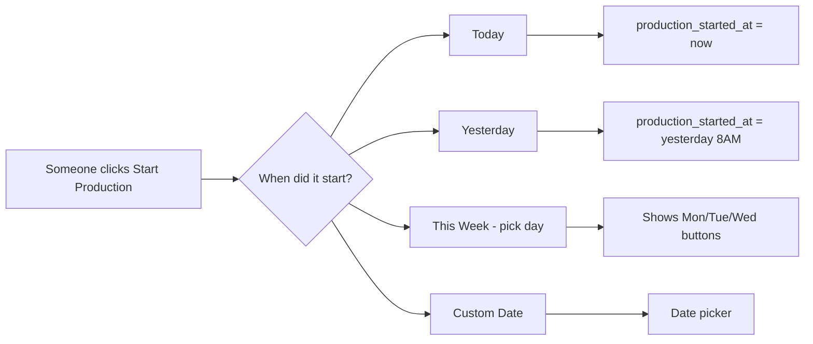
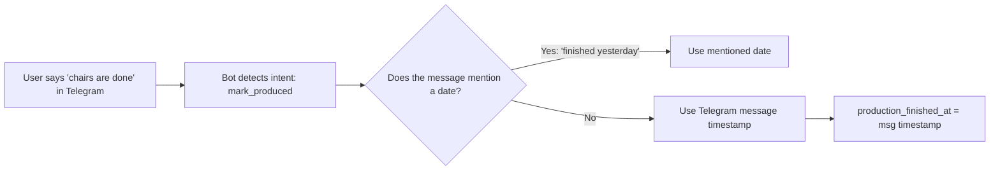
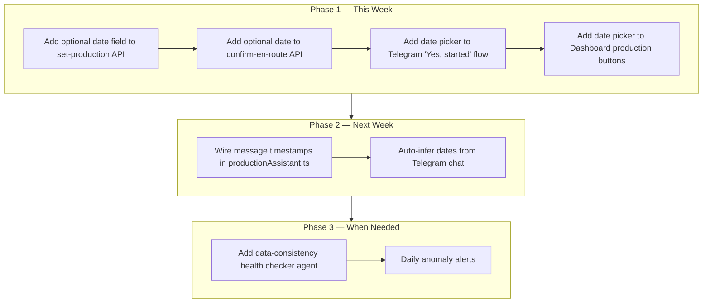

# Data Accuracy Proposal — Handling Late Entries in Production Tracking

## The Problem

| Scenario | What happens now | Why it's wrong |
|---|---|---|
| Production started 3 days ago, but nobody clicked "Start Production" until today | `production_started_at = today` (wrong — should be 3 days ago) | ETA says "5 days remaining" but really only 2 |
| Items were shipped yesterday, but marked en_route today | `en_route_confirmed_at = today` | Delivery ETA off by 1 day |
| Order was confirmed last week by phone, but entered into system today | `order_confirmed_at = today` | All downstream dates shift |

## Proposed Solutions (Ranked)

### Solution 1: ⭐ "Yesterday/Monday" Quick Date Pickers (BEST)

**Idea:** When marking production_started, en_route, delivered — let users pick a **relative date** instead of forcing today.

**Implementation:**
- Add `started_at_date` (optional TEXT) field to `set-production` endpoint
- Same for `confirm-en-route` endpoint
- Dashboard: add "Started on:" dropdown alongside the confirm button
- Telegram: after tapping "Yes, started" → ask "When? (Today / Yesterday / Monday)"

**Effort:** Low (2 API endpoints + 2 UI changes)
**Impact:** High — covers 90% of late-entry cases

---

### Solution 2: 🧠 Smart Event Detection via Stage Updates

**Idea:** Look at **stage_updates** audit log to infer actual dates. If someone posts a message "QTN-xxx chairs are done" in Telegram, the bot can backfill the actual production_finished_at from the message timestamp instead of the button-click timestamp.

**Current code already does this partially** via `productionAssistant.ts` — it detects "done" and "finished" intents. We just need to wire the message timestamp into the API call.

**Effort:** Medium (modify production assistant to pass message date to API)
**Impact:** Medium — helps when people use natural language in Telegram

---

### Solution 3: 🕒 Scheduled Data Cleanup (Background Health Check)

**Idea:** Nightly agent that detects **data anomalies** and sends alerts:

| Anomaly | Detection | Action |
|---|---|---|
| `production_started_at` > order_created_at + 14 days | SQL: `WHERE production_started = true AND production_started_at > created_at + interval '14 days'` | Send alert to escalation group: "⚠️ QTN-xxx production_started_at seems late — was production really idle for 14 days?" |
| Production finished but no items marked produced | Check `order_items` all pending but `production_finished = true` | Alert: items not tracked |
| En route confirmed but delivery items not created | Check `order_items` have `en_route_status = 'not_yet'` | Alert |

**Effort:** Medium (new agent or add to existing escalation agent)
**Impact:** Low-medium — catches problems after they happen, not before

---

## Recommendation

**Do Solution 1 first** — it's the simplest, fixes 90% of cases, and doesn't require AI.

**Key design principle:** The date field is **optional** — if omitted, system uses current time (existing behavior). If provided, it overrides the timestamp. This means:
- No breaking changes
- Team can adopt gradually
- Power users can always back-date
- Casual users get the default "now"

Would you like me to implement **Solution 1** (relative date pickers) next?

The flow would be:
1. Tap "Yes, started" in Telegram
2. Bot asks: "When did production start?" with inline buttons: `📅 Today` `📅 Yesterday` `📅 Monday` `📅 Custom...`
3. If custom, user types a date (e.g., `June 15`)
4. API stores `production_started_at = chosen_date`
