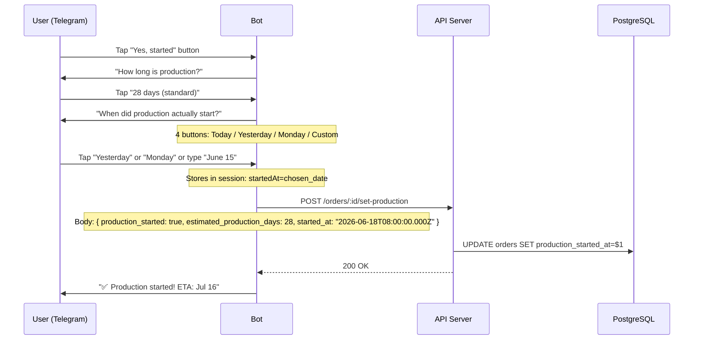
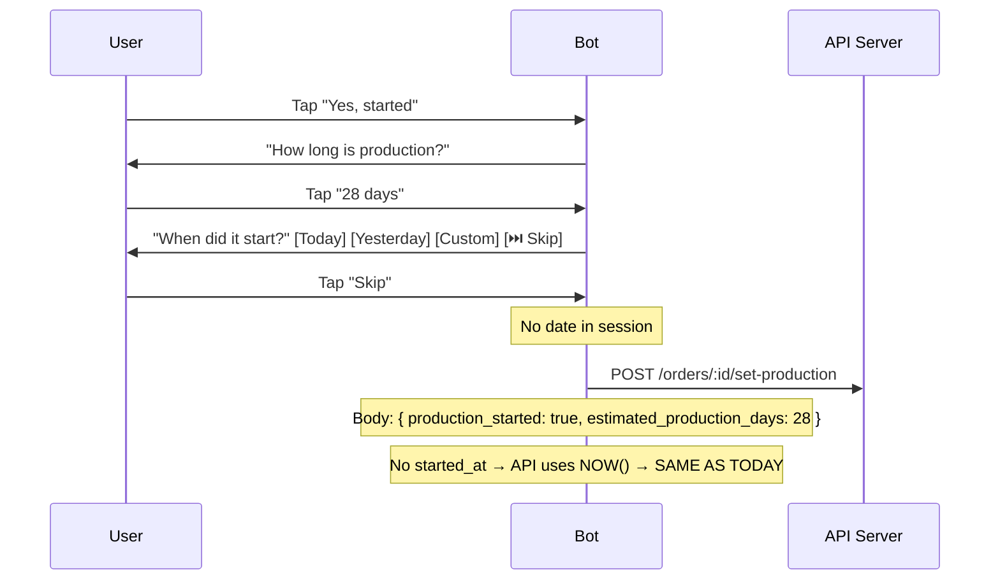
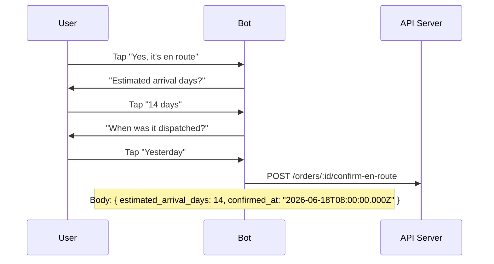
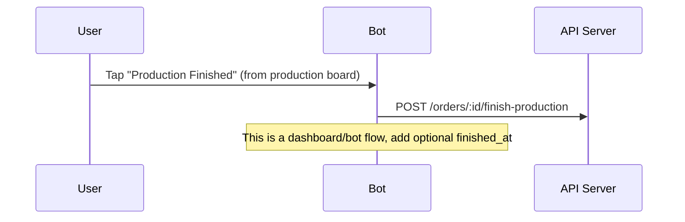
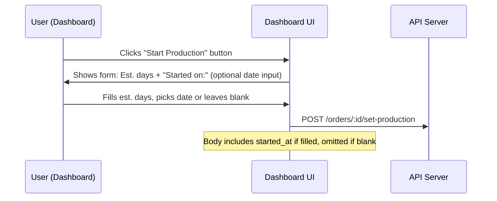

# Date Accuracy Feature — Complete Execution Plan

## Overview

Add optional "When did this actually happen?" date pickers to every status-change flow. The date is **always optional** — if omitted, the system uses `NOW()` exactly as today. Zero breaking changes.

---

## Part 1: Full User Workflow Diagrams

### A. Telegram — Start Production



### B. Telegram — Skip Date (EXACT current behavior)



### C. Telegram — En Route Confirmation



### D. Telegram — Production Finished



### E. Dashboard — Start Production Modal



---

## Part 2: Exact Code Changes (File-by-File)

### File 1: `apps/api/src/server.ts` — 3 endpoints, ~9 lines total

#### Change 1: `set-production` endpoint (line ~2191)

```typescript
// BEFORE:
if (body.production_started) {
  setClauses.push(`production_started_at = COALESCE(production_started_at, NOW())`);
  setClauses.push(`current_stage = 'production_in_progress'`);
}

// AFTER:
if (body.production_started) {
  if (body.started_at) {
    setClauses.push(`production_started_at = $${idx++}`);
    values.push(body.started_at);
  } else {
    setClauses.push(`production_started_at = COALESCE(production_started_at, NOW())`);
  }
  setClauses.push(`current_stage = 'production_in_progress'`);
}
```

Also add to schema:
```typescript
const setProductionSchema = z.object({
  production_started: z.boolean(),
  estimated_production_days: z.number().int().positive().optional(),
  started_at: z.string().datetime().optional(),  // NEW
  current_stage: z.string().optional(),
  split_item: z.string().optional(),
  action_token: z.string().optional(),
});
```

#### Change 2: `confirm-en-route` endpoint (line ~3277)

```typescript
// BEFORE:
const rows = await query(
  `UPDATE orders SET en_route_confirmed = TRUE, en_route_confirmed_at = NOW(),
   estimated_arrival_days = $1, current_stage = 'en_route_verification', updated_at = NOW()
   WHERE id = $2 RETURNING *`,
  [body.estimated_arrival_days, id]
);

// AFTER:
const enRouteAt = body.confirmed_at ?? 'NOW()';
const rows = await query(
  `UPDATE orders SET en_route_confirmed = TRUE,
   en_route_confirmed_at = ${enRouteAt === 'NOW()' ? 'NOW()' : `$${idx++}`},
   estimated_arrival_days = $1, current_stage = 'en_route_verification', updated_at = NOW()
   WHERE id = ${enRouteAt === 'NOW()' ? '$2' : `$${idx}`} RETURNING *`,
  enRouteAt === 'NOW()' ? [body.estimated_arrival_days, id] : [body.estimated_arrival_days, enRouteAt, id]
);
```

#### Change 3: `finish-production` endpoint (line ~2695)

```typescript
// BEFORE:
const rows = await query(
  `UPDATE orders SET production_finished = TRUE, production_finished_at = NOW(),
   delivery_estimated_days = $1, current_stage = 'en_route', updated_at = NOW()
   WHERE id = $2 RETURNING *`,
  [body.delivery_estimated_days, id]
);

// Same pattern as above — accept optional finished_at
```

### File 2: `apps/telegram-bot/src/bot.ts` — 2 callback handlers

#### Change 1: `produce:yes` handler (line ~4495)

After the user selects production days, insert a new state:
```typescript
// BEFORE:
setStep(chatId, { action: 'awaiting_produce_custom_days', quotationNumber, orderId });
// → directly asks for days

// AFTER:
setStep(chatId, { action: 'awaiting_produce_date', quotationNumber, orderId });
await ctx.editMessageText(
  `📅 When did production actually start for ${quotationNumber}?`,
  {
    parse_mode: 'Markdown',
    ...Markup.inlineKeyboard([
      [Markup.button.callback('📅 Today', `produce:date:today:${orderIdPart}:${quotationNumber}`)],
      [Markup.button.callback('📅 Yesterday', `produce:date:yesterday:${orderIdPart}:${quotationNumber}`)],
      [Markup.button.callback('📅 Monday', `produce:date:monday:${orderIdPart}:${quotationNumber}`)],
      [Markup.button.callback('✏️ Custom date...', `produce:date:custom:${orderIdPart}:${quotationNumber}`)],
      [Markup.button.callback('⏭️ Skip (use now)', `produce:date:skip:${orderIdPart}:${quotationNumber}`)],
    ]),
  }
);
```

New handler for the date callbacks:
```typescript
// Handle date selection
bot.action(/^produce:date:(today|yesterday|monday|custom|skip):(.+)$/, async (ctx) => {
  const chatId = String(ctx.chat!.id);
  const dateType = ctx.match[1]; // today, yesterday, monday, custom, skip
  const rest = ctx.match[2];
  const parts = rest.split(':');
  const orderId = parts[0];
  const quotationNumber = parts.slice(1).join(':');
  const session = getSession(chatId);

  if (dateType === 'skip') {
    // Set date to null → API will use NOW()
    session.productionStartedAt = null;
    // Now proceed to ask for days
    setStep(chatId, { action: 'awaiting_produce_custom_days', quotationNumber, orderId });
    await ctx.editMessageText(
      `🏭 *Production Started* — ${quotationNumber}\n\nHow long is production? (standard 28 days?)`,
      {
        parse_mode: 'Markdown',
        ...Markup.inlineKeyboard([
          [Markup.button.callback('📅 28 days (standard)', `produce:days:28:${orderId}:${quotationNumber}`)],
          [Markup.button.callback('✏️ Enter custom days', `produce:custom:${orderId}:${quotationNumber}`)],
          [Markup.button.callback('❌ Cancel', 'action:cancel')],
        ]),
      }
    );
    return;
  }

  // Calculate the date
  const now = new Date();
  let startedAt: Date;
  switch (dateType) {
    case 'today': startedAt = now; break;
    case 'yesterday': startedAt = new Date(now.getTime() - 86400000); break;
    case 'monday': {
      const day = now.getDay(); // 0=Sun, 1=Mon
      const diff = day === 0 ? -6 : 1 - day; // Days back to Monday
      startedAt = new Date(now.getTime() + diff * 86400000);
      break;
    }
    case 'custom':
      // Set step to await date text
      setStep(chatId, { action: 'awaiting_produce_custom_date', quotationNumber, orderId });
      await ctx.editMessageText(`📅 Enter the date (e.g., "June 15" or "2026-06-15"):`, { parse_mode: 'Markdown' });
      return;
    default: startedAt = now;
  }

  // Store in session
  session.productionStartedAt = startedAt.toISOString();
  
  // Proceed to ask for days
  setStep(chatId, { action: 'awaiting_produce_custom_days', quotationNumber, orderId });
  await ctx.editMessageText(
    `🏭 *Production Started* — ${quotationNumber}\n\nHow long is production?`,
    {
      parse_mode: 'Markdown',
      ...Markup.inlineKeyboard([
        [Markup.button.callback('📅 28 days (standard)', `produce:days:28:${orderId}:${quotationNumber}`)],
        [Markup.button.callback('✏️ Enter custom days', `produce:custom:${orderId}:${quotationNumber}`)],
        [Markup.button.callback('❌ Cancel', 'action:cancel')],
      ]),
    }
  );
});
```

#### Change 2: Modify the API call in `produce:days` handler

```typescript
// BEFORE:
await postJson(`/orders/${order.id}/set-production`, {
  production_started: true,
  estimated_production_days: body.estimated_production_days,
  action_token: actionToken,
});

// AFTER:
const session = getSession(chatId);
const body: any = {
  production_started: true,
  estimated_production_days: body.estimated_production_days,
  action_token: actionToken,
};
if (session.productionStartedAt) {
  body.started_at = session.productionStartedAt;
  delete session.productionStartedAt; // Clean up
}
await postJson(`/orders/${order.id}/set-production`, body);
```

### File 3: `apps/dashboard/src/app/purchasing/page.tsx` — Add date input

Find the "Start Production" button section and add an optional date input:

```tsx
// Add this input alongside existing estimated_days field
<div>
  <label className="text-xs font-medium text-gray-600">Started on (optional)</label>
  <input
    type="date"
    value={productionStartDate || ''}
    onChange={(e) => setProductionStartDate(e.target.value)}
    className="w-full rounded border px-2 py-1 text-sm"
  />
</div>
```

Then pass it to the API call:
```typescript
const startedAt = productionStartDate ? new Date(productionStartDate + 'T00:00:00+08:00').toISOString() : undefined;
await postJson(`/orders/${order.id}/set-production`, {
  production_started: true,
  estimated_production_days: estimatedDays,
  started_at: startedAt,  // undefined if not filled → API ignores it
  action_token: actionToken,
});
```

---

## Part 3: Bug Prevention Strategy

### 3a: Unit-Equivalent Checks (manual, before commit)

| Check | How to verify |
|-------|-------------|
| Skip → NOW() | Call `/set-production` without `started_at` → verify `production_started_at` ≈ now |
| Yesterday → correct date | Call with `started_at: yesterday` → verify stored date |
| Custom date → exact | Call with `started_at: 2026-06-15` → verify stored date is June 15 |
| Existing data untouched | Query orders with already-set `production_started_at` → verify NOT overwritten |
| Null field | Call with `started_at: null` → verify treated as skip (COALESCE to NOW) |
| Production not started | Call with `production_started: false` → verify started_at ignored |

### 3b: SQL COALESCE protection

The `COALESCE(production_started_at, NOW())` pattern already ensures:
- If `production_started_at` is already set → preserves it (can't overwrite)
- Only sets it on FIRST call

Our new code uses the same pattern:
```sql
production_started_at = COALESCE($1, production_started_at, NOW())
```
This means: `$1` (user's date) if provided → else keep existing → else NOW().

### 3c: Zod schema validation

```typescript
started_at: z.string().datetime().optional()
```
This ensures only valid ISO datetime strings pass through. Invalid dates get rejected at the schema level.

### 3d: Rollback plan

If something goes wrong:
```bash
# Deploy previous working commit
git revert HEAD --no-edit
git push origin master
ssh root@100.86.182.7 "cd /opt/quotation-automation && git pull && docker compose up -d api telegram-bot --force-recreate"
```

Estimated rollback time: **2 minutes**

---

## Part 4: Execution Order (To Minimize Bugs)

```
Step 1: Add started_at to Zod schema in server.ts     [1 line, 30s]
Step 2: Modify SET clause in set-production endpoint   [4 lines, 2 min]
Step 3: Modify SET clause in confirm-en-route endpoint [4 lines, 2 min]
Step 4: Modify SET clause in finish-production endpoint[4 lines, 2 min]
Step 5: Build API → TypeScript check                  [30s]
Step 6: Add Telegram date picker handler               [60 lines, 15 min]
Step 7: Wire session date into produce:days handler    [5 lines, 2 min]
Step 8: Add custom date text handler                   [20 lines, 5 min]
Step 9: Build bot → TypeScript check                   [30s]
Step 10: Add Dashboard date input                      [10 lines, 5 min]
Step 11: Build dashboard → next build check            [30s]
Step 12: Docker compose build --parallel               [5 min]
Step 13: Git commit + push                             [1 min]
Step 14: VPS git pull + deploy                         [5 min]
Step 15: Test: skip → verify NOW()                     [1 min]
Step 16: Test: yesterday → verify date                 [1 min]
Step 17: Test: custom date → verify date               [1 min]
                                                      ─────────
                                              Total: ~42 minutes
```

---

## Part 5: Summary — What the User Experiences

| Scenario | Before | After |
|----------|--------|-------|
| User clicks immediately | `production_started_at = NOW()` ✅ Correct | Same |
| User clicks 3 days late | `production_started_at = NOW()` ❌ Wrong | `production_started_at = 3 days ago` ✅ Correct |
| User clicks "Skip" | N/A | `production_started_at = NOW()` — exact same as before |
| User types custom date | Not possible | `production_started_at = "June 15"` — exact date stored |
