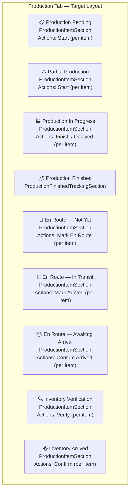

# Plan: Convert All Production Tab Sections to Item-Level

## Objective
Make ALL production tab sections use item-level actions instead of order-level actions. Users should interact with individual items, not entire orders.

## Current Architecture

The production tab has two parallel UI patterns:

1. **`OrderSection` + `OrderRow`** — Shows expandable order cards. When expanded, `ProductionInfoCards` renders inside showing an item-level table with action buttons. Used by:
   - Production Pending
   - En Route Verification
   - En Route Tracking
   - En Route — Awaiting Arrival
   - Inventory Verification
   - Inventory Arrived

2. **`ProductionItemSection`** — Shows expandable order cards. When expanded, shows a dedicated item table with action buttons. Used by:
   - Partial Production (item-level Start)
   - Production In Progress (item-level Finished/Delayed)

## Target Architecture

ALL sections use `ProductionItemSection` with item-level actions.



## Changes Required

### Phase 1: Extend ProductionItemSection

The component currently supports:
- `showStartButton` / `onItemStartConfirm`
- `showFinishedButton` / `onItemFinished`
- `showDelayedButton` / `onItemDelayed`

**New props to add:**

```typescript
// En Route actions
showEnRouteButton?: boolean;
showArrivedButton?: boolean;
onItemEnRoute?: (order: Order, item: OrderItem) => void;
onItemArrived?: (order: Order, item: OrderItem) => void;

// Inventory actions
showInventoryVerifyButton?: boolean;
showInventoryArrivedButton?: boolean;
onItemInventoryVerify?: (order: Order, item: OrderItem) => void;
onItemInventoryArrived?: (order: Order, item: OrderItem) => void;
```

**Item table columns to add:**
- En Route status badge
- Inventory status badge

### Phase 2: Convert Each Section

| Section | Current Component | Target Component | Item Filter | Buttons |
|---|---|---|---|---|
| **Production Pending** | `OrderSection` + `OrderRow` | `ProductionItemSection` | All items | Start |
| **Partial Production** | `ProductionItemSection` | Keep | `production_status === 'pending'` | Start |
| **Production In Progress** | `ProductionItemSection` | Keep | `production_status !== 'pending'` | Finish, Delayed |
| **En Route — Not Yet** | `OrderSection` + `OrderRow` | `ProductionItemSection` | `en_route_status === 'not_yet'` | Mark En Route |
| **En Route — In Transit** | `OrderSection` + `OrderRow` | `ProductionItemSection` | `en_route_status === 'en_route'` | Mark Arrived |
| **En Route — Awaiting Arrival** | `OrderSection` + `OrderRow` | `ProductionItemSection` | `en_route_status !== 'arrived'` | Confirm Arrived |
| **Inventory Verification** | `OrderSection` + `OrderRow` | `ProductionItemSection` | `inventory_status !== 'verified'` | Verify |
| **Inventory Arrived** | `OrderSection` + `OrderRow` | `ProductionItemSection` | `inventory_status === 'verified'` | Confirm |

### Phase 3: Remove Order-Level Actions

From `OrderRow`, remove these order-level button groups for production tab sections:
- **Start Production** button (line 670) — no longer needed, items start individually
- **Production Confirmed actions** (line 677) — On Time / Delayed / Finish Production — already removed
- **Confirm En Route** button (line 700) — no longer needed, items confirm individually
- **Proceed to Inventory Verification** button (line 707) — no longer needed, items verify individually

Keep:
- Edit/Delete buttons (these are order-level admin actions)
- Exception buttons (these are order-level financial decisions)

### Phase 4: Data Flow Changes

**Current order-level handlers to remove/replace:**

| Handler | Current | Target |
|---|---|---|
| `handleStartProduction` | Order-level, opens modal for overall + per-item days | Replaced by `handleItemStartConfirm` (per-item) |
| `handleFinishProduction` | Order-level, prompts delivery days, OTP | Replaced by `handleItemFinish` (per-item) |
| `handleConfirmEnRoute` | Order-level, prompts arrival days, OTP | Replaced by `handleItemEnRoute` (per-item) |
| `handleProceedInventoryVerification` | Order-level, OTP | Replaced by `handleItemInventoryVerify` (per-item) |
| `handleReportOnTime` | Order-level | Replaced by item-level status tracking |
| `handleReportDelayed` | Order-level | Replaced by item-level delayed status |

**OTP flow:**
All item-level actions already go through OTP via the existing `handleItemProductionStatusVerified` and `handleItemEnRouteStatusVerified` callbacks. New handlers (`handleItemInventoryVerify`, `handleItemInventoryArrived`) would need similar OTP wiring.

### Phase 5: Stat Cards and Info

`ProductionItemSection` currently shows only the item table. The `OrderRow` + `ProductionInfoCards` combo showed:
- Order-level stat cards (production started at, estimated days, finish date, etc.)
- Progress bar
- Item completion percentages

These need to be shown somewhere in the new item-level layout. Options:
1. Add a "stat cards" row below each order's item table in `ProductionItemSection`
2. Show stat cards in the order header (collapsible)
3. Show them in a tooltip/popover

**Recommendation:** Show stat cards below each expanded order's item table, similar to how `ProductionInfoCards` does it.

### Phase 6: Clean Up

After conversion, remove from production page:
- `OrderSection` usage (for production tab sections)
- `OrderRow` usage (for production tab sections)
- `ProductionInfoCards` usage (functionality merged into `ProductionItemSection`)
- Unused handler functions
- Unused imports

## Risks and Considerations

1. **Stage advancement logic** — Currently, order-level actions advance the order stage. With item-level actions, stage advancement needs to happen when ALL items reach a certain state. This logic may need to move to the API layer.

2. **Production Finished section** — This section uses `ProductionFinishedTrackingSection` which shows order-level summaries. May need to remain as order-level or be converted to show item-level summaries.

3. **Exception handling** — Grant/Revoke Exception is an order-level financial decision. Should remain order-level.

4. **En route data source** — En Route sections use `useOrdersByStage('en_route')` and split into sub-sections based on `enRouteCompletion` (item completion percentages). With item-level sections, we'd need to filter at the item level.

5. **Backward compatibility** — The API endpoints (`/api/orders/:id/finish-production`, `/api/orders/:id/confirm-en-route`, etc.) are order-level. Item-level actions use `/api/orders/:id/items/:itemId` (PATCH). Need to verify all actions have item-level API support.

## API Verification Needed

Check if these item-level APIs exist:
- `PATCH /api/orders/:id/items/:itemId` — Update item production_status ✅
- `PATCH /api/orders/:id/items/:itemId` — Update item en_route_status ✅
- `PATCH /api/orders/:id/items/:itemId` — Update item inventory_status ❓ Need to verify

## Implementation Order

1. **Phase 1:** Extend `ProductionItemSection` with new props and columns
2. **Phase 2:** Convert Production Pending to `ProductionItemSection`
3. **Phase 3:** Convert En Route sections
4. **Phase 4:** Convert Inventory sections
5. **Phase 5:** Add stat cards to `ProductionItemSection`
6. **Phase 6:** Clean up — remove OrderRow/OrderSection/ProductionInfoCards from production tab
7. **Test and deploy**
