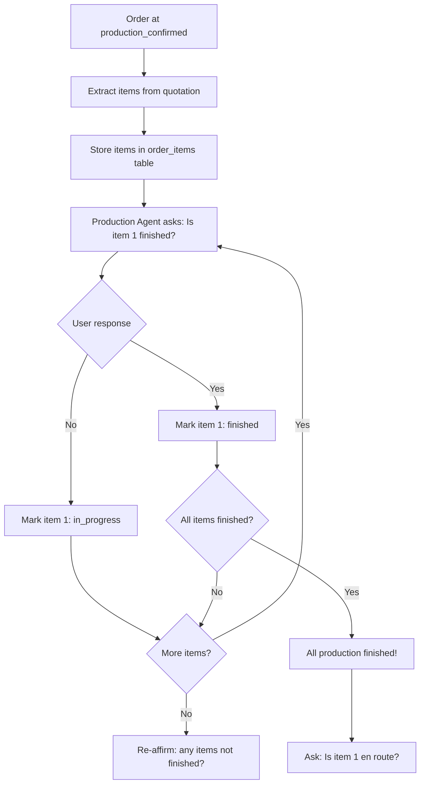
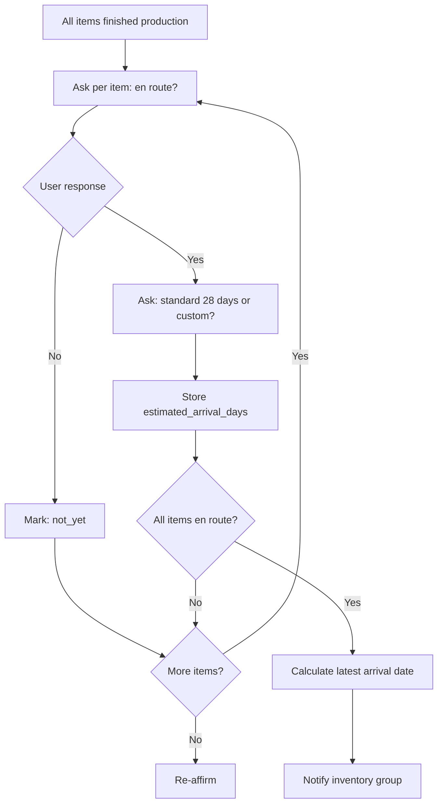

# Item-Level Production Tracking with Hermes Claw

## Overview

Upgrade the production workflow to track items individually per order. Hermes Claw will:
1. Ask about each item's production status one-by-one
2. Use process of elimination to confirm all items are finished
3. Ask about each item's en-route status one-by-one
4. Collect delivery timeline per item (standard 28 days or custom)
5. Notify inventory group with estimated delivery dates

## Database Schema

### New Table: `order_items`

```sql
CREATE TABLE order_items (
    id UUID PRIMARY KEY DEFAULT gen_random_uuid(),
    order_id UUID NOT NULL REFERENCES orders(id) ON DELETE CASCADE,
    name TEXT NOT NULL,
    quantity INTEGER DEFAULT 1,
    production_status TEXT NOT NULL DEFAULT 'pending',
    -- pending, in_progress, finished
    en_route_status TEXT NOT NULL DEFAULT 'not_yet',
    -- not_yet, en_route, arrived
    estimated_arrival_days INTEGER,
    -- standard 28 or custom
    created_at TIMESTAMPTZ DEFAULT NOW(),
    updated_at TIMESTAMPTZ DEFAULT NOW()
);

CREATE INDEX idx_order_items_order_id ON order_items(order_id);
```

### New Table: `production_update_logs`

```sql
CREATE TABLE production_update_logs (
    id UUID PRIMARY KEY DEFAULT gen_random_uuid(),
    order_item_id UUID REFERENCES order_items(id) ON DELETE CASCADE,
    order_id UUID NOT NULL REFERENCES orders(id) ON DELETE CASCADE,
    note TEXT NOT NULL,
    log_type TEXT NOT NULL DEFAULT 'user',
    -- user, agent, system
    created_by TEXT,
    created_at TIMESTAMPTZ DEFAULT NOW()
);

CREATE INDEX idx_production_logs_order_item_id ON production_update_logs(order_item_id);
CREATE INDEX idx_production_logs_order_id ON production_update_logs(order_id);
```

## Data Flow

### 1. Item Extraction (when order reaches `production_confirmed`)

Hermes Claw extracts items from the quotation text stored in file-store:
- Parse quotation text using Gemini AI
- Extract item names and quantities
- Store in `order_items` table
- Fallback: allow manual item entry via dashboard

### 2. Production Tracking Flow (item-by-item)



### 3. En-Route Tracking Flow (item-by-item)



### 4. Inventory Agent Notification

Inventory agent receives:
- "Order #X for [Client] estimated delivery: [latest date across all items]"
- Per-item breakdown with individual ETA
- Tracks items as they arrive

## API Changes

### New Endpoints

- `POST /orders/:id/items` — Add/update items for an order
- `GET /orders/:id/items` — Get items for an order
- `PATCH /order-items/:itemId` — Update item status
- `POST /orders/:id/extract-items` — Hermes AI extracts items from quotation
- `GET /orders/:id/production-logs` — Get production logs
- `POST /orders/:id/production-logs` — Add production log

### Updated Endpoints

- `POST /orders/:id/finish-production` — Now marks all items as finished
- `POST /orders/:id/confirm-en-route` — Now per-item with days input

## Agent Changes

### Production Agent (`apps/api/src/agents/productionAgent.ts`)

1. **Item extraction on production_confirmed**
   - New `extractItemsFromQuotation(orderId)` function
   - Uses Hermes Claw to parse quotation text
   - Creates `order_items` records

2. **Item-by-item production tracking**
   - New reminder stage: `production_item_check`
   - Sends: "Production check for #order — Item: [name]. Is this item finished?"
   - Buttons: "✅ Finished" / "⏳ Not yet"

3. **Re-affirmation logic**
   - After all items responded, asks: "You confirmed all items finished. Is this correct?"
   - Buttons: "✅ Yes, all finished" / "⚠️ Let me recheck"

4. **Item-by-item en-route tracking**
   - New reminder stage: `en_route_item_check`
   - Sends: "En route check — Item: [name]. Is this item en route?"
   - If yes: "Standard 28 days or custom?" / If no: continue to next item

### Inventory Agent (`apps/api/src/agents/inventoryAgent.ts`)

1. **Hermes Claw integration**
   - New `analyzeInventoryOrder()` function
   - Smart notification with delivery dates

2. **Per-item arrival tracking**
   - New reminder stage: `inventory_item_arrival`
   - Asks per item: "Has [item name] arrived?"
   - Process of elimination until all arrive

3. **Notification on all items en route**
   - Receives: "Order #X for [client] — all items en route. Estimated available by [date]."

## Telegram Bot Changes (`apps/telegram-bot/src/bot.ts`)

### New Callback Handlers

- `item:finished:itemId:quotationNumber` — Mark item as finished
- `item:not_finished:itemId:quotationNumber` — Mark item as not finished
- `item:en_route:itemId:quotationNumber` — Mark item as en route
- `item:not_en_route:itemId:quotationNumber` — Mark item as not en route
- `item:arrival_standard:itemId:quotationNumber` — Standard 28 days
- `item:arrival_custom:itemId:quotationNumber` — Custom days
- `items:all_finished:orderId:quotationNumber` — Confirm all finished
- `items:recheck:orderId:quotationNumber` — Recheck items

### New User Steps

- `awaiting_item_production_status` — Waiting for item production response
- `awaiting_item_en_route_status` — Waiting for item en-route response
- `awaiting_item_arrival_days` — Waiting for custom arrival days
- `awaiting_item_arrival_confirm` — Waiting for item arrival confirmation

## Dashboard Changes

### New Components

- `OrderItemsTable` — Display items with status
- `ProductionLogTimeline` — Show update logs per item
- `ItemStatusBadge` — Color-coded status badge

### Updated Pages

- `/production/page.tsx` — Show item-level tracking
- `/orders/[quotationNumber]/page.tsx` — Show items and logs

## Implementation Phases

### Phase 1: Database & API Foundation
- Create migration for `order_items` and `production_update_logs`
- Add API endpoints for CRUD operations
- Update OrderRow interface

### Phase 2: Production Agent Item Tracking
- Item extraction from quotation text
- Item-by-item production reminders
- Process of elimination logic

### Phase 3: En-Route Per-Item Tracking
- Item-by-item en-route confirmation
- Standard 28 days / custom days selection
- Calculate latest arrival date

### Phase 4: Inventory Agent Hermes Upgrade
- Smart notification with delivery dates
- Per-item arrival tracking
- Process of elimination for arrival

### Phase 5: Telegram Bot Callbacks
- All new callback handlers
- Conversational flow for item tracking

### Phase 6: Dashboard
- Item-level tracking display
- Production log timeline
- Status updates

## Key Design Decisions

1. **Item source**: Extract from quotation text via Hermes AI, with manual override
2. **Process of elimination**: The bot asks one item at a time, cycling through all items. When all respond, it re-affirms.
3. **Delivery timeline**: Per-item (standard 28 days or custom). Order-level ETA = latest item ETA.
4. **Update logs**: Per-item notes that both agents and users can add. Viewable as a timeline.
