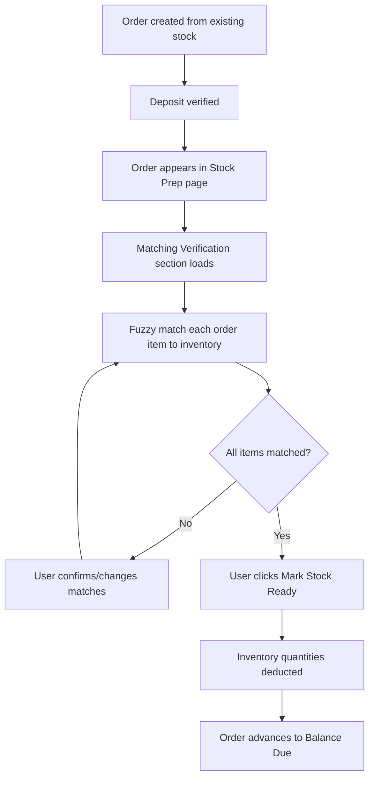

# Matching Verification Feature — Architecture Plan

## Overview
When an order is created from existing stock, it goes to the Stock Prep stage. Before marking stock ready, the user must verify which inventory item matches each order item. The system suggests the best match via fuzzy matching, and the user can confirm or manually select a different inventory item.

## Flow



---

## Phase 1: Database Migration (migration 039)

**File**: `database/migrations/039_stock_matching.sql`

```sql
-- Add matched_inventory_item_id to order_items for stock orders
ALTER TABLE order_items
ADD COLUMN IF NOT EXISTS matched_inventory_item_id UUID REFERENCES inventory_items(id) ON DELETE SET NULL;

-- Add index for quick lookup
CREATE INDEX IF NOT EXISTS idx_order_items_matched_inventory
ON order_items(matched_inventory_item_id);

-- Add a flag to track if matching is verified
ALTER TABLE order_items
ADD COLUMN IF NOT EXISTS inventory_match_verified BOOLEAN DEFAULT FALSE;
```

**TypeScript type update** in `apps/dashboard/src/lib/api.ts`:
- Add `matched_inventory_item_id?: string | null` to `OrderItem`
- Add `inventory_match_verified?: boolean` to `OrderItem`

---

## Phase 2: Backend API Endpoints

### 2a. GET /inventory/search
Search inventory items by text query (product_name, description, dimension).

```typescript
app.get('/inventory/search', async (request, reply) => {
  const { q } = request.query as { q: string };
  const limit = Math.min(parseInt((request.query as any).limit) || 20, 50);
  if (!q || q.trim().length < 2) return reply.status(400).send({ error: 'Query must be at least 2 characters' });
  
  const search = `%${q.trim().toLowerCase()}%`;
  const rows = await query(
    `SELECT * FROM inventory_items
     WHERE LOWER(product_name) LIKE $1
        OR LOWER(description) LIKE $1
        OR LOWER(dimension) LIKE $1
     ORDER BY
       CASE WHEN LOWER(product_name) = LOWER($2) THEN 0 ELSE 1 END,
       CASE WHEN LOWER(product_name) LIKE $1 THEN 0 ELSE 1 END,
       quantity DESC
     LIMIT $3`,
    [search, q.trim(), limit]
  );
  return { items: rows };
});
```

### 2b. POST /inventory/match
Fuzzy-match an order item description against all inventory items. Returns ranked candidates.

```typescript
app.post('/inventory/match', async (request, reply) => {
  const body = z.object({
    item_name: z.string(),
    quantity: z.number().optional(),
    limit: z.number().optional().default(5),
  }).parse(request.body);

  const inventory = await query(`SELECT * FROM inventory_items ORDER BY created_at DESC`, []);
  
  // Compute fuzzy similarity scores
  const candidates = inventory.map((inv: InventoryItem) => ({
    ...inv,
    score: fuzzyMatchScore(body.item_name, inv.product_name, inv.description, inv.dimension),
  }));
  
  candidates.sort((a, b) => b.score - a.score);
  return { candidates: candidates.slice(0, body.limit) };
});
```

**Fuzzy matching algorithm** (simple, no AI API needed):
```typescript
function fuzzyMatchScore(query: string, productName: string, description: string | null, dimension: string | null): number {
  const q = query.toLowerCase().trim();
  const pn = (productName || '').toLowerCase();
  const desc = (description || '').toLowerCase();
  const dim = (dimension || '').toLowerCase();
  
  let score = 0;
  const qTokens = q.split(/\s+/);
  
  // Exact match on product name
  if (pn === q) score += 100;
  else if (pn.includes(q)) score += 50;
  
  // Token overlap on product name
  qTokens.forEach(t => { if (pn.includes(t)) score += 10; });
  
  // Description match
  qTokens.forEach(t => { if (desc.includes(t)) score += 5; });
  
  // Dimension match (if query has numbers/dimensions)
  qTokens.forEach(t => {
    if (/\d/.test(t) && dim.includes(t)) score += 15;
  });
  
  // Bonus for quantity availability
  if (inventory.quantity > 0) score += 5;
  
  return score;
}
```

### 2c. PATCH /orders/:order_id/items/:item_id/match-inventory
Save the matched inventory item for an order item.

```typescript
app.patch('/orders/:order_id/items/:item_id/match-inventory', async (request, reply) => {
  const params = z.object({
    order_id: z.string().uuid(),
    item_id: z.string().uuid(),
  }).parse(request.params);
  
  const body = z.object({
    inventory_item_id: z.string().uuid().nullable(),
    verified: z.boolean().optional(),
  }).parse(request.body);

  await query(
    `UPDATE order_items
     SET matched_inventory_item_id = $1,
         inventory_match_verified = COALESCE($2, inventory_match_verified),
         updated_at = NOW()
     WHERE id = $3 AND order_id = $4`,
    [body.inventory_item_id, body.verified ?? null, params.item_id, params.order_id]
  );
  
  // Fetch the updated item with inventory details
  const rows = await query(
    `SELECT oi.*, ii.product_name AS matched_product_name,
            ii.description AS matched_description,
            ii.dimension AS matched_dimension,
            ii.quantity AS matched_inventory_qty
     FROM order_items oi
     LEFT JOIN inventory_items ii ON oi.matched_inventory_item_id = ii.id
     WHERE oi.id = $1`,
    [params.item_id]
  );
  
  return { ok: true, item: rows[0] };
});
```

---

## Phase 3: Frontend Changes

### 3a. API Functions in `apps/dashboard/src/lib/api.ts`

```typescript
export async function searchInventory(q: string, limit?: number): Promise<{ items: InventoryItem[] }> {
  const params = new URLSearchParams();
  params.set('q', q);
  if (limit) params.set('limit', String(limit));
  return fetchJson<{ items: InventoryItem[] }>(`/inventory/search?${params.toString()}`);
}

export async function matchInventoryToItem(itemName: string, quantity?: number, limit?: number): Promise<{ candidates: InventoryItem[] }> {
  return fetchJson<{ candidates: InventoryItem[] }>('/inventory/match', {
    method: 'POST',
    body: JSON.stringify({ item_name: itemName, quantity, limit }),
  });
}

export async function matchOrderItemToInventory(
  orderId: string,
  itemId: string,
  inventoryItemId: string | null,
  verified?: boolean,
): Promise<{ ok: boolean; item: OrderItem }> {
  return fetchJson<{ ok: boolean; item: OrderItem }>(
    `/orders/${encodeURIComponent(orderId)}/items/${encodeURIComponent(itemId)}/match-inventory`,
    {
      method: 'PATCH',
      body: JSON.stringify({ inventory_item_id: inventoryItemId, verified }),
    },
  );
}
```

### 3b. Stock Prep Page Updates

Add a **"Matching Verification"** section at the top of the Stock Prep page, before the order cards. This section appears for each stock-prep order that has items.

#### Layout
```
┌─────────────────────────────────────────────────────────────────┐
│  Matching Verification — 3 items need verification               │
├─────────────────────────────────────────────────────────────────┤
│                                                                 │
│  Order: QTN-Stock-001  |  Client: John Doe                       │
│  ┌────────────────────┬───────────────────────────────────────┐  │
│  │ Order Item         │ Matched Inventory                      │  │
│  ├────────────────────┼───────────────────────────────────────┤  │
│  │ Queen Bed Frame    │ 🏆 Queen Bed 60x75                    │  │
│  │ Qty: 1             │ Qty in stock: 5 ✅                     │  │
│  │                    │ [✓ Confirm]  [🔍 Search...]            │  │
│  ├────────────────────┼───────────────────────────────────────┤  │
│  │ Side Table         │ ⚠️ No match found                      │  │
│  │ Qty: 2             │ [🔍 Search inventory...]               │  │
│  ├────────────────────┼───────────────────────────────────────┤  │
│  │ Wardrobe           │ 🏆 Wardrobe 2-Door                     │  │
│  │ Qty: 1             │ Qty in stock: 0 ❌ (insufficient)      │  │
│  │                    │ [🔍 Search inventory...]               │  │
│  └────────────────────┴───────────────────────────────────────┘  │
│                                                                 │
│  [✅ All items verified — Mark Stock Ready →]                   │
│                                                                 │
└─────────────────────────────────────────────────────────────────┘
```

#### MatchCard Component
- **Left side**: Order item name, quantity, and status badge
- **Right side**: 
  - If matched: shows inventory item name, quantity, stock status, Confirm button, Search button
  - If no match: shows "No match found" + Search button
  - Search button opens a searchable dropdown/modal with inventory items

#### Search Modal / Dropdown
- Text input for searching inventory
- Tabs: "All", "By Name", "By Category"
- Real-time search results from GET /inventory/search
- Each result shows: product name, description, dimension, quantity, image thumbnail
- Click to select → saves match via PATCH /orders/:order_id/items/:item_id/match-inventory

### 3c. Mark Stock Ready Guard

Before allowing "Mark Stock Ready", verify:
1. All order items have a `matched_inventory_item_id`
2. All matched items have sufficient quantity (`matched_inventory_qty >= order_item.quantity`)
3. Show a warning if any item is unverified or has insufficient stock

If unverified items exist, show: "⚠️ 2 items not yet matched. Please verify matches before marking ready."

---

## Phase 4: Stock Deduction on Mark Ready

Update the `markStockReady` logic (or `POST /orders/:id/stock-ready`) to:

1. Verify all items have `matched_inventory_item_id`
2. For each matched item, deduct `order_item.quantity` from `inventory_items.quantity`
3. If `inventory_items.quantity` would go negative, return error
4. Proceed with advancing order to Balance Due

---

## Frictionless UX Design Decisions

1. **Auto-suggest on load**: When the Matching Verification section opens, automatically call `POST /inventory/match` for each item and show the top candidate with a "✓ Looks right" button
2. **One-click confirm**: If the top match is correct, user clicks once to confirm. No typing needed.
3. **Search only when needed**: If no match or wrong match, user clicks the search button
4. **Tabs in search modal**: 
   - "All Results" (default)
   - "By Name" (filters by product_name)
   - "By Description" (filters by description)
5. **Visual stock indicator**: Green badge if quantity >= needed, red badge if insufficient
6. **Batch confirm**: "Confirm All Suggested Matches" button at the top
7. **Sticky order header**: When scrolling through multiple items, the order info stays visible
8. **Keyboard support**: Tab through items, Enter to confirm, / to focus search

---

## Files to Modify

| File | Change |
|------|--------|
| `database/migrations/039_stock_matching.sql` | New migration |
| `apps/api/src/server.ts` | Add 3 new endpoints |
| `apps/dashboard/src/lib/api.ts` | Add API functions + update OrderItem interface |
| `apps/dashboard/src/app/stock-prep/page.tsx` | Add Matching Verification section |
| `docs/CHANGELOG.md` | Record commit |
| `docs/UPDATE_LOG.md` | Track work |

## Cost Estimate
- No AI API calls needed — fuzzy matching is local
- Only database queries, which are fast
- Search endpoint is a simple LIKE query on indexed columns
